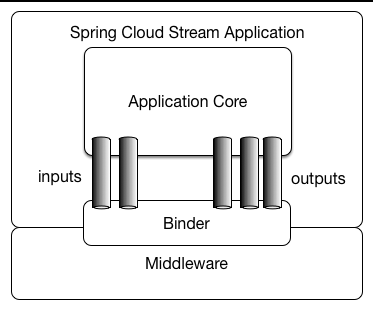
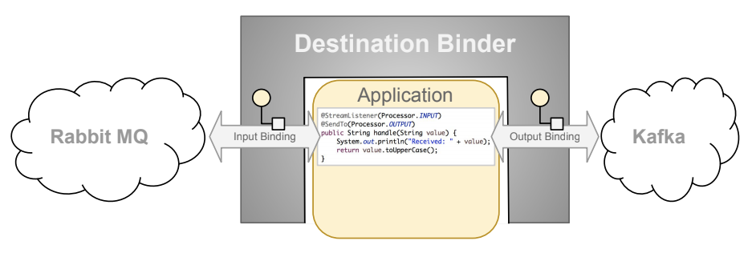

# Spring Boot 中使用Spring Cloud Stream

> [Spring Cloud Stream](https://spring.io/projects/spring-cloud-stream) 用于构建高可扩展的使用消息系统连接的事件驱动服务的框架





- Binder: 负责提供与外部消息系统集成的组件
- Binding: 提供外部消息系统与应用之间桥接的生产者和消费者
- Message: 生产者和消费者与外部消息系统之间通信的数据结构


## 构建应用

假设一个点咖啡场景：调用下单接口后，需要通知店员制作咖啡，待制作完成后，需要更新订单状态为完成，并通知客户；假设有两个服务，一个是订单服务(Order Service)，一个是店员服务(Waiter Service)

使用 RabbitMQ 作为MQ 服务

### Order Service

##### 添加依赖

- build.gradle

```groovy
dependencies {
    implementation 'org.springframework.boot:spring-boot-starter-web'
    implementation 'org.springframework.cloud:spring-cloud-stream-binder-rabbit'

    compileOnly 'org.projectlombok:lombok'
    annotationProcessor 'org.projectlombok:lombok'
    testImplementation 'org.springframework.boot:spring-boot-starter-test'
    testImplementation 'org.springframework.cloud:spring-cloud-stream-test-support'
}
```

##### 添加配置

- application.properties

```properties
spring.application.name=producer
server.port=8082
spring.rabbitmq.host=localhost
spring.rabbitmq.port=5672
spring.rabbitmq.username=guest
spring.rabbitmq.password=guest
```


##### Binding 

- OrderBinding

```java
public interface OrderBinding {

    String NEW_ORDERS = "newOrders";
    String FINISHED_ORDERS = "finishedOrders";

    @Input
    SubscribableChannel finishedOrders();

    @Output
    MessageChannel newOrders();
}
```

`@Input`用于指定订阅消息Topic，当有该 Topic 的消息时会调用监听该消息的处理器
`@Output`用于指定发送消息Topic，可以通过该MessageChannel发送消息 

##### 发送消息

```java
@RestController
public class OrderController {

    @Autowired
    private OrderBinding orderBinding;

    @GetMapping("/newOrder")
    public Object sendMessage(Long orderId, Long userId) {
        OrderVO orderVO = OrderVO.builder()
                                 .orderId(orderId)
                                 .userId(userId)
                                 .build();

        boolean result = orderBinding.newOrders().send(MessageBuilder.withPayload(orderVO).build());

        return new HashMap<String, String>() {{
            put("message", result ? "下单成功" : "下单失败");
        }};
    }
}
```

发送消息可以通过注入 Binding 对象，或者注入 `MessageChannel`对象时指定 Bean 来实现

```java
    @Autowired
    private OrderBinding orderBinding;

	// 或者
	
    @Autowired
    @Qualifier(OrderBinding.FINISHED_ORDERS)
    private MessageChannel messageChannel;
```

- OrderServiceApplication.java

```java
@SpringBootApplication
@EnableBinding({OrderBinding.class})
public class OrderServiceApplication {

    public static void main(String[] args) {
        SpringApplication.run(OrderServiceApplication.class, args);
    }
}
```

### Waiter Service

##### 添加依赖

- build.gradle 

```groovy
dependencies {
    implementation 'org.springframework.cloud:spring-cloud-stream-binder-rabbit'

    compileOnly 'org.projectlombok:lombok'
    annotationProcessor 'org.projectlombok:lombok'
    testImplementation 'org.springframework.boot:spring-boot-starter-test'
    testImplementation 'org.springframework.cloud:spring-cloud-stream-test-support'
}
```

##### 添加配置

- application.properties

```properties
spring.rabbitmq.host=localhost
spring.rabbitmq.port=5672
spring.rabbitmq.username=guest
spring.rabbitmq.password=guest
```

##### 监听消息

- OrderBinding 

```java
public interface OrderBinding {

    String NEW_ORDERS = "newOrders";
    String FINISHED_ORDERS = "finishedOrders";

    @Input
    SubscribableChannel newOrders();

    @Output
    MessageChannel finishedOrders();
}
```

- WaiterListener

```java
@Component
@Slf4j
public class WaiterListener {

    @StreamListener(OrderBinding.NEW_ORDERS)
    @SendTo(OrderBinding.FINISHED_ORDERS)
    public OrderVO newOrders(OrderVO orderVO) {
        log.info("收到用户:{} 的新订单:{}", orderVO.getUserId(), orderVO.getOrderId());
        try {
            Thread.sleep(10000);
        } catch (InterruptedException e) {
            log.error("制作失败", e);
        }

        return orderVO;
    }
}
```

这里在收到消息后等待制作完成，发送订单完成的消息给 Order Service，执行后续动作

`@StreamListener`用于监听指定 Topic 并处理
`@SendTo`用于指定处理的结果要发送的下一个 Topic

- WaiterServiceApplication.java

```java
@SpringBootApplication
@EnableBinding({OrderBinding.class})
public class WaiterServiceApplication {

    public static void main(String[] args) {
        SpringApplication.run(WaiterServiceApplication.class, args);
    }

}
```


### Order Service 处理后续消息

##### 订单完成消息

收到订单完成的消息后发送通知消息

- NotifyBinding.java

```java
public interface NotifyBinding {

    String SEND_NOTIFY = "sendNotify";

    @Output
    MessageChannel sendNotify();
}
```

- OrderListener.java

```java
@Component
@Slf4j
public class OrderListener {

    @StreamListener(OrderBinding.FINISHED_ORDERS)
    @SendTo(NotifyBinding.SEND_NOTIFY)
    public NotifyMessage finishedOrdersHandler(OrderVO orderVO) {
        log.info("用户:{} 的订单:{} 已完成", orderVO.getUserId(), orderVO.getOrderId());
        return NotifyMessage.builder()
                            .title("订单已完成")
                            .userId(orderVO.getUserId())
                            .sendTime(LocalDateTime.now())
                            .build();
    }
}
```

##### 处理通知消息

- NotifyListener.java

```java
@Component
@Slf4j
public class NotifyListener {

    @StreamListener(NotifyBinding.SEND_NOTIFY)
    public void sendNotifyHandler(NotifyMessage notifyMessage) {
        log.info("发送标题为:{} 的消息给用户:{}", notifyMessage.getTitle(), notifyMessage.getUserId());
    }
}
```

### 测试 

- 启动RabbitMQ 

```bash
docker run -d --name rabbit -p 4369:4369 -p 5672:5672 -p 15671:15671 -p 15672:15672 -p 25672:25672 --hostname localhost -e RABBITMQ_DEFAULT_USER=guest -e RABBITMQ_DEFAULT_PASS=guest rabbitmq:3-management
```

- 启动 WaiterService 和 OrderService
- 发送下单请求

```bash
curl 'localhost:8082/newOrder?orderId=1&userId=2'
{"message":"下单成功"}%
```
- 然后会看到 WaiterService 和 OrderService 的相应的监听器都接收到了消息并打印日志


----------

## 其他类型消息

- Transform

如果一个消息需要处理加工后继续发给下一个，可以直接使用`@Transformer`注解来代替`@StreamListener`和`@SendTo`

```java
@Component
public class TransformerListener {

    @Transformer(inputChannel = TransoformBinding.INPUT, outputChannel = TransoformBinding.OUTPUT)
    public Object transform(String message) {
        return message.toUpperCase();
    }
}
```

- 定时消息

```java
@Component
public class TimerAdapter {

    @InboundChannelAdapter(value = OrderBinding.NEW_ORDERS, poller = @Poller(fixedDelay = "10", maxMessagesPerPoll = "1"))
    @Bean
    public MessageSource<OrderVO> timerMessageSource() {

        OrderVO orderVO = OrderVO.builder()
                                 .userId(1L)
                                 .orderId(1L)
                                 .build();

        return () -> new GenericMessage<>(orderVO);
    }
}
```