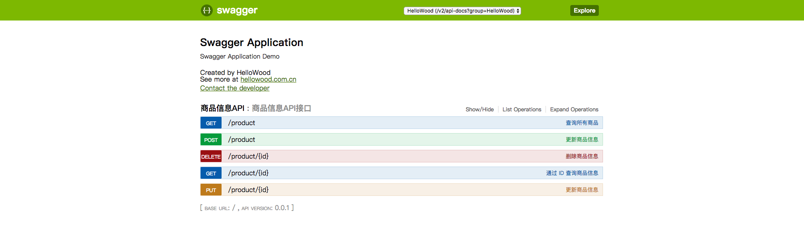
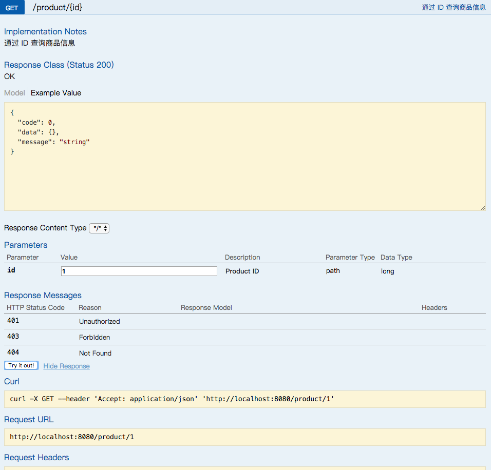
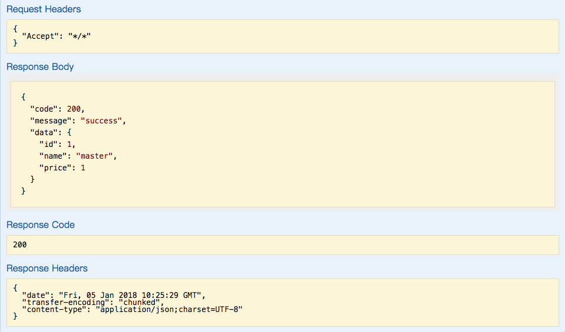

# Spring Boot 集成 Swagger API 文档工具

> [Swaager](https://swagger.io/) 是一个开源用于设计、撰写、测试 RESTful API 的工具

## 添加依赖

```groovy
	compile('io.springfox:springfox-swagger2:2.7.0')
	compile('io.springfox:springfox-swagger-ui:2.7.0')
```

## 配置 Swagger
```java
package cn.com.hellowood.swagger.configuration;

import org.springframework.context.annotation.Bean;
import org.springframework.context.annotation.Configuration;
import springfox.documentation.builders.ApiInfoBuilder;
import springfox.documentation.builders.PathSelectors;
import springfox.documentation.builders.RequestHandlerSelectors;
import springfox.documentation.service.ApiInfo;
import springfox.documentation.service.Contact;
import springfox.documentation.spi.DocumentationType;
import springfox.documentation.spring.web.plugins.Docket;
import springfox.documentation.swagger2.annotations.EnableSwagger2;

@EnableSwagger2
@Configuration
public class Swagger2Configuration {

    @Bean
    public Docket createRestApi() {
        return new Docket(DocumentationType.SWAGGER_2)
                .groupName("HelloWood")
                .apiInfo(apiInfo())
                .select()
                // 扫描的包所在位置
                .apis(RequestHandlerSelectors.basePackage("cn.com.hellowood.swagger.controller"))
                // 扫描的 URL 规则
                .paths(PathSelectors.any())
                .build();
    }


    private ApiInfo apiInfo() {
        // 联系信息
        Contact contact = new Contact("HelloWood", "hellowood.com.cn", "hellowoodes@outlook.com");
        return new ApiInfoBuilder()
                // 大标题
                .title("Swagger Application")
                // 描述
                .description("Swagger Application Demo")
                // 服务条款 URL
                .termsOfServiceUrl("http://hellowood.com.cn")
                .contact(contact)
                // 版本
                .version("0.0.1-SNAPSHOT")
                .build();
    }
}

```

## 添加 Model 描述

- Product.java

```java
package cn.com.hellowood.swagger.modal;

import io.swagger.annotations.Api;
import io.swagger.annotations.ApiModelProperty;

import java.io.Serializable;

@Api(value = "Product", description = "商品类")
public class Product implements Serializable {
    private static final long serialVersionUID = 1435515995276255188L;

    @ApiModelProperty(notes = "主键")
    private long id;

    @ApiModelProperty(notes = "名称")
    private String name;

    @ApiModelProperty(notes = "价格")
    private long price;

    // ...
}

```

- CommonResponse.java
```java
package cn.com.hellowood.swagger.common;

import cn.com.hellowood.swagger.utils.JSONUtil;
import io.swagger.annotations.ApiModelProperty;

public class CommonResponse {

    @ApiModelProperty(notes = "状态码")
    private int code;

    @ApiModelProperty(notes = "返回消息")
    private String message;

    @ApiModelProperty(notes = "返回的数据")
    private Object data;
    
    // ...
}

```

## 添加 API 接口及描述

- ProductController.java
```java
package cn.com.hellowood.swagger.controller;

import cn.com.hellowood.swagger.common.CommonResponse;
import cn.com.hellowood.swagger.common.ResponseUtil;
import cn.com.hellowood.swagger.modal.Product;
import cn.com.hellowood.swagger.service.ProductService;
import cn.com.hellowood.swagger.utils.ServiceException;
import io.swagger.annotations.*;
import org.springframework.beans.factory.annotation.Autowired;
import org.springframework.web.bind.annotation.*;

// 类描述
@Api(value = "商品信息", tags = {"商品信息API"}, description = "商品信息API接口")
@RestController
@RequestMapping("/product")
public class ProductController {

    @Autowired
    private ProductService productService;

    @ApiOperation(value = "查询所有商品", notes = "查询所有的商品信息", httpMethod = "GET")
    @ApiResponses({
            @ApiResponse(code = 200, message = "请求成功", response = CommonResponse.class),
            @ApiResponse(code = 400, message = "请求参数错误", response = CommonResponse.class),
            @ApiResponse(code = 401, message = "未授权的访问", response = CommonResponse.class),
            @ApiResponse(code = 403, message = "拒绝访问", response = CommonResponse.class),
            @ApiResponse(code = 404, message = "资源不存在", response = CommonResponse.class),
            @ApiResponse(code = 500, message = "服务器内部错误", response = CommonResponse.class)
    })
    @GetMapping
    public CommonResponse getAllProduct() {
        return ResponseUtil.generateResponse(productService.getAllProduct());
    }
    

    @ApiOperation(value = "通过 ID 查询商品信息", notes = "通过 ID 查询商品信息", httpMethod = "GET", response = CommonResponse.class)
    @ApiImplicitParam(name = "id", value = " Product ID", required = true, paramType = "path", dataType = "Long")
    @GetMapping("/{id}")
    public CommonResponse getProduct(@PathVariable("id") Long productId) throws ServiceException {
        return ResponseUtil.generateResponse(productService.select(productId));
    }


    @ApiOperation(value = "更新商品信息", notes = "通过 ID 更新商品信息", httpMethod = "PUT", response = CommonResponse.class)
    @ApiImplicitParams({
            @ApiImplicitParam(name = "id", value = "商品 ID", required = true, paramType = "path", dataType = "Long"),
            @ApiImplicitParam(name = "newProduct", value = "商品信息对象", required = true, dataType = "Product", dataTypeClass = Product.class)
    })
    @PutMapping("/{id}")
    public CommonResponse updateProduct(@PathVariable("id") Long productId, @RequestBody Product newProduct) throws ServiceException {
        return ResponseUtil.generateResponse(productService.update(productId, newProduct));
    }


    @ApiOperation(value = "删除商品信息", notes = "通过 ID 删除商品信息", httpMethod = "DELETE", response = CommonResponse.class)
    @ApiImplicitParam(name = "id", value = "商品 ID", required = true, paramType = "path", dataType = "Long")
    @DeleteMapping("/{id}")
    public CommonResponse deleteProduct(@PathVariable("id") long productId) throws ServiceException {
        return ResponseUtil.generateResponse(productService.delete(productId));
    }


    @ApiOperation(value = "更新商品信息", notes = "通过 ID 更新商品信息", httpMethod = "POST", response = CommonResponse.class)
    @ApiImplicitParam(name = "newProduct", value = "商品信息对象", required = true, dataType = "Product", dataTypeClass = Product.class)
    @PostMapping
    public CommonResponse addProduct(@RequestBody Product newProduct) throws ServiceException {
        return ResponseUtil.generateResponse(productService.add(newProduct));
    }
}

```
## 查看及测试 API 

启动应用并访问[http://localhost:8080/swagger-ui.html]() 即可查看和测试相关 API 





[相关注解说明](https://github.com/helloworlde/SpringBootCollection/blob/master/SpringBoot-Swagger/Swagger.md)
