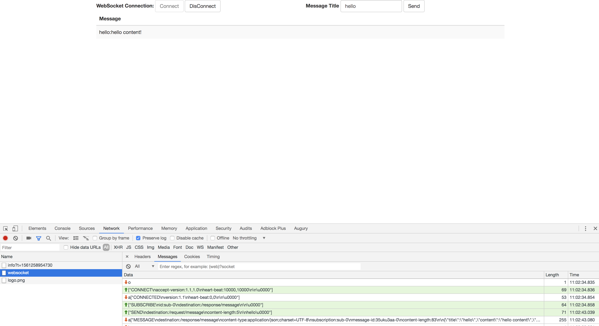

# Spring Boot  中使用 WebSocket 

> WebSocket 是一种长连接技术，可以实现服务端和客户端的双向通信，服务端可以主动推送信息给客户端

## 构建应用 

### 添加依赖

- build.gradle 

```groovy
dependencies {
    compile("org.springframework.boot:spring-boot-starter-websocket")
    compile("org.webjars:webjars-locator-core")
    compile("org.webjars:sockjs-client:1.0.2")
    compile("org.webjars:stomp-websocket:2.3.3")
    compile("org.webjars:bootstrap:3.3.7")
    compile("org.webjars:jquery:3.1.0")

    testCompile("org.springframework.boot:spring-boot-starter-test")
}
```

### 实现

#### 配置 

- WebSocketConfig.java

```java
@Configuration
@EnableWebSocketMessageBroker
public class WebSocketConfig implements WebSocketMessageBrokerConfigurer {

    @Override
    public void configureMessageBroker(MessageBrokerRegistry registry) {
        registry.enableSimpleBroker("/topic");
        registry.setApplicationDestinationPrefixes("/app");
    }

    @Override
    public void registerStompEndpoints(StompEndpointRegistry registry) {
        registry.addEndpoint("/socket").withSockJS();
    }
}
```

其中`/topic` 是用于推送给客户端的消息路径前缀；`/app`是用于请求服务端的消息路径前缀， `/socket`用于客户端建立连接

#### 添加接口 

- MessageHandler.java

```java
@Slf4j
@Controller
public class MessageHandler {

    @MessageMapping("/message")
    @SendTo("/response/message")
    public Message message(String title) {
        log.info("Receive new message, title is :" + title);

        return Message.builder()
                      .title(title)
                      .content(title + " content!")
                      .createTime(LocalDateTime.now())
                      .build();
    }
}
```

#### 添加客户端

使用HTML 构建一个简单的客户端，用于建立连接和发送、接收消息

- index.html 

```html
<!DOCTYPE html>
<html lang="en">
<head>
    <meta charset="UTF-8">
    <title>WebSocket</title>
    <link href="/webjars/bootstrap/css/bootstrap.min.css" rel="stylesheet">
    <script src="/webjars/jquery/jquery.min.js"></script>
    <script src="/webjars/sockjs-client/sockjs.min.js"></script>
    <script src="/webjars/stomp-websocket/stomp.min.js"></script>

    <script src="/index.js"></script>
</head>
<body>
<div id="main-content" class="container">
    <div class="row">
        <div class="col-md-6">
            <form class="form-inline">
                <div class="form-group">
                    <label for="connect">WebSocket Connection:</label>
                    <button id="connect" class="btn btn-default" type="submit">Connect</button>
                    <button id="disconnect" class="btn btn-default" type="submit" disabled="disabled">
                        DisConnect
                    </button>
                </div>
            </form>
        </div>
        <div class="col-md-6">
            <form action="" class="form-inline">
                <div class="form-group">
                    <label for="name">Message Title</label>
                    <input type="text" id="name" class="form-control" placeholder="Input message here...">
                </div>
                <button id="send" class="btn btn-default" type="submit">
                    Send
                </button>
            </form>
        </div>
    </div>

    <div class="row">
        <div class="col-md-12">
            <table id="conversation" class="table table-striped">
                <thead>
                <tr>
                    <th>Message</th>
                </tr>
                </thead>
                <tbody id="messages">

                </tbody>
            </table>
        </div>
    </div>
</div>
</body>
</html>
```

- index.js

```javascript
var stompClient = null;

function setConnected(connected) {
    $("#connect").prop("disabled", connected);
    $("#disconnect").prop("disabled", !connected);

    if (connected) {
        $("#conversation").show();
    } else {
        $("#conversation").hide();
    }
    $("#messages").html("");
}

function connect() {
    var socket = new SockJS('/socket');
    stompClient = Stomp.over(socket);
    stompClient.connect({}, function (frame) {
        setConnected(true);
        console.log('Connected:' + frame);
        stompClient.subscribe('/response/message', function (message) {
            console.log("Receive message from server:" + message);
            showMessage(JSON.parse(message.body));
        });
    });
}

function disconnect() {
    if (stompClient !== null) {
        stompClient.disconnect();
    }
    setConnected(false);
    console.log("Disconnected");
}

function sendMessage() {
    stompClient.send("/request/message", {}, $("#name").val());
}

function showMessage(message) {
    $("#messages").append("<tr><td>" + message.title + ":" + message.content + "</td></tr>")
}

$(function () {
    $("form").on('submit', function (e) {
        e.preventDefault();
    });

    $("#connect").click(function () {
        connect();
    });

    $("#disconnect").click(function () {
        disconnect();
    });

    $("#send").click(function () {
        sendMessage();
    });
});
```

- 建立连接并订阅消息

```javascript
function connect() {
    var socket = new SockJS('/socket');
    stompClient = Stomp.over(socket);
    stompClient.connect({}, function (frame) {
        setConnected(true);
        console.log('Connected:' + frame);
        stompClient.subscribe('/response/message', function (message) {
            console.log("Receive message from server:" + message);
            showMessage(JSON.parse(message.body));
        });
    });
}
```

- 发送消息

```javascript
function sendMessage() {
    stompClient.send("/request/message", {}, $("#name").val());
}
```

## 测试 

- 启动应用，打开两个浏览器，访问 [http://localhost:8080/](http://localhost:8080/)


- 点击 Connect，建立连接



- 其中任意一个发送一个消息，两个浏览器都可以接受到这个消息


-------------

### 参考文档 

- [Using WebSocket to build an interactive web application](https://spring.io/guides/gs/messaging-stomp-websocket/)
- [Spring Boot + WebSockets + Angular 5](https://medium.com/oril/spring-boot-websockets-angular-5-f2f4b1c14cee)